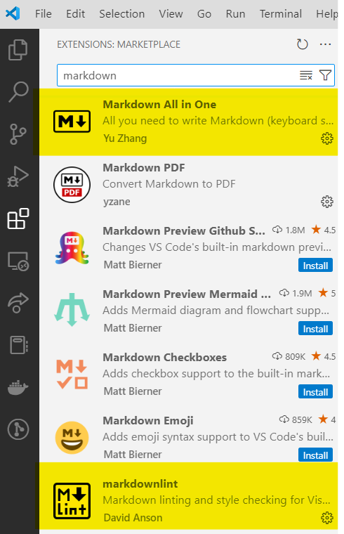

# README Format Reference

## 0. Tips

### VSCode Markdown Extension Recommendation

<figure>
    
</figure>

## 1. Headings

# Course Recommendation: ESE5190

## Course Recommendation: ESE519

### Course Recommendation: ESE51

#### Course Recommendation: ESE5

##### Course Recommendation: ESE

###### Course Recommendation: ES

## 2. Emphasis

### Bold

Bold text is the **cat's meow**.

### Italic

Italicized text is the *cat's meow*.

### Bold & Italic

Bold & Italicized text is the ***cat's meow***.

## 3. Lists

### Ordered Lists

1. Cats

2. Parrots

    1. Caique Parrot

    2. Cockatiel

    3. Cockatoo

3. Rabbits

### Unordered Lists

- Dogs

    - Retriever

        - Labrador Retriever
    
        - Golden Retriever
    
    - Shepherd Dog
    
        - German Shepherd Dog

        - Collie

- Cats

## 4. Blockquotes

> The Labrador tried fetching the ball, but the German Shepherd insisted on supervising, and the Collie just rolled its eyes!

### Nested Blockquotes

> The Caique Parrot is plotting something mischievous, while the Cockatiel is just whistling innocently in the corner.
> 
>> Meanwhile, the Macaw is being loud, and the Cockatoo is busy showing off its dance moves!
> 
> The Labrador tried fetching the ball, but the German Shepherd insisted on supervising, and the Collie just rolled its eyes!

### Blockquotes with Other Elements

> #### ESE5190 is a great course!
>
> - No labs
> - No projects
>
>  *Everyone* will get **full points**.

## 5. Code

At the command prompt, type `sudo apt update`.

### Code Blocks

```c
/**
* This is C language.
*/
#include <stdio.h>

int main()
{
    printf("ESE5190");
}
```

```python
# This is python
print("ESE5190")
```

## 6. Links

More links for reference: 

1. Link to Basic Syntax: [Basic Syntax](https://www.markdownguide.org/basic-syntax/#blockquotes-1)

2. Getting started with writing and formatting on GitHub URL: <https://docs.github.com/en/get-started/writing-on-github/getting-started-with-writing-and-formatting-on-github>

## 7. Images

There are several ways to add an image to your README file (see below), but the most efficient method is to **simply copy and paste the image directly into your code editor (e.g., VSCode)**. If you have the recommended extensions installed, you should be able to paste the image into your README.

After pasting, you’ll see something like `` in your markdown, and the image file will appear in your repository. To keep your repo organized, consider creating an "images" folder and moving all image files there. Don’t forget to update the image path in the markdown to something like ``.


The Markdown syntax for images doesn’t allow you to specify the width and height of images. If you need to resize an image, you can use the img HTML tag with the width and height attributes to set the dimensions of an image in pixels.

<figure>
    
    <figcaption>Cat.zip</figcaption>
</figure>

### Ways to add an image to a README file on GitHub

1. **Direct Image Link (Hosted Online)**:

   - Use an image hosted online by inserting its URL in the markdown:

     ```markdown
     
     ```

2. **Relative Path (Image in the Repository)**:

   - Place the image in your repository and reference it using a relative path:

     ```markdown
     
     ```

3. **Copy-Paste in VSCode**:

   - If you are using VSCode with recommended extensions, you can copy an image and paste it directly into the README file. This will automatically add the image to your repo and create the correct markdown syntax:

     ```markdown
     
     ```

4. **Using HTML**:

   - If more control is needed (like setting width or height), you can use HTML inside your markdown:

     ```html
     
     ```

## 8. Tables

|      |Points   |Grade  |
|------|---------| ------|
|STU1  |50       |F      |
|STU2  |70       |C      |
|STU3  |90       |A      |

## 9. Mathematic Symbols

The *Gamma function*, which satisfies $\Gamma(n) = (n-1)!\quad\forall n\in\mathbb N$, is defined by the Euler integral

$$
\Gamma(z) = \int_0^\infty t^{z-1} e^{-t} \, dt\,.
$$

## 10. Horizontal Rules

The first way of adding a Horizontal Rule: 

***

The second way of adding a Horizontal Rule: 

---

The third way of adding a Horizontal Rule: 

_________________